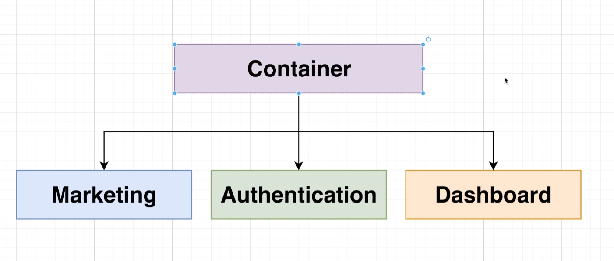
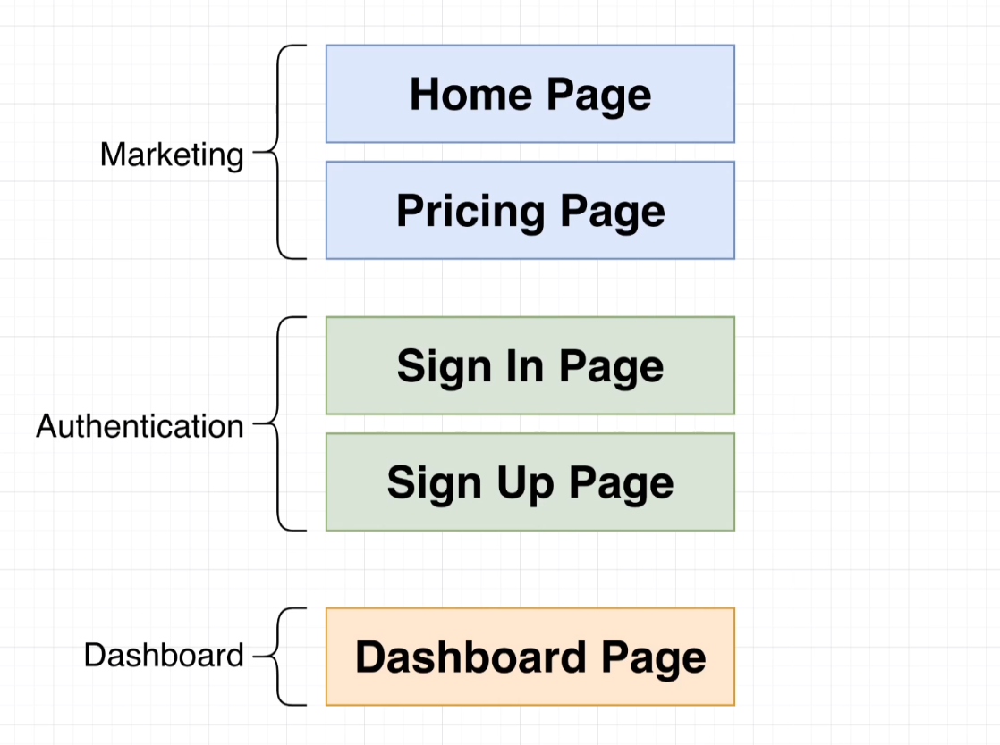

# Micro - Frontend
This is a mono-repo with 3 apps without no coupling between each other

## Apps

## Apps Details

## Requirements for the Deployment
- Want to deploy each micro-frontend independently (including the container)
- Location of child app remoteEntry.js files must be known at build time!
- Many front-end deployment solutions assume you're deploying a single project - we need something that can handle multiple different ones
- Probably need a CI/CD pipeline of some sort
- At present, the remoteEntry.js file name is fixed! Need to think about caching issues

## Path to Deployment to production
